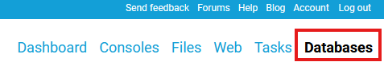
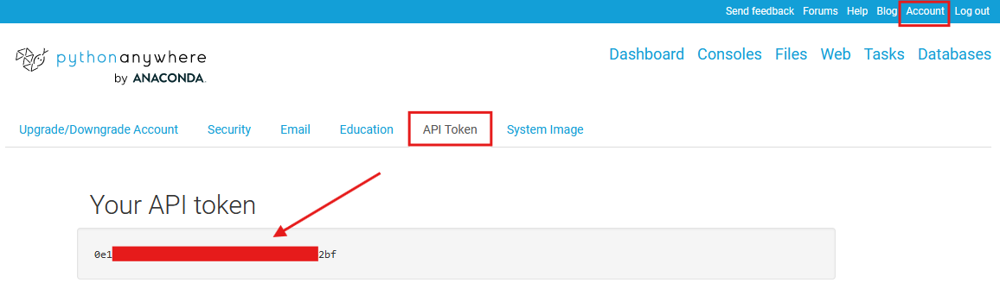

# Proyecto de BackEnd para el programa Codo a Codo


---

**Table of Contents**

[TOC]

## Descripción general

El proyecto se trata de un sistema que permite administrar una base de datos de productos, implementado una API en Python utilizando el framework Flask. Las operaciones que se realizarán en este proyecto es dar de alta, modificar, eliminar y listar los productos, operaciones que podrán hacer los usuarios a través de una página Web.

Como ejemplo trabajaremos con una empresa de venta de artículos de computación que ofrece sus productos a través de una Web.

Aquí hay un resumen de las principales características y funcionalidades del proyecto:

**Gestión de productos:**
- Agregar un nuevo producto al catálogo.
- Mostrar un listado de los productos en el catálogo.
- Modificar la información de un producto existente en el catálogo.
- Eliminar un producto del catálogo.

**Persistencia de datos:**
- Los datos de los productos se almacenan en una base de datos SQL.
- Se utiliza una conexión a la base de datos para realizar operaciones CRUD en los productos.
- El código proporcionado incluye las clases Catálogo, que representa la estructura y funcionalidad relacionada con el catálogo de productos. Además, se define una serie de rutas en Flask para manejar las solicitudes HTTP relacionadas con la gestión de productos.

Se implementan desde cero el backend y el frontend. En el caso del backend, el proyecto va "evolucionando", comenzando en el desarrollo de las funciones que se necesitan para manipular los productos utilizando arreglos en memoria, luego se modifica para utilizar objetos, más tarde se gestiona la persistencia de los datos utilizando una base de datos SQL, se aloja el script Python en un servidor, y por último se crea un frontend básico para interactuar con los datos desde el navegador, a través de la API creada. Para este primer proyecto de BackEnd no vamos a utilizar entornos virtuales de ningun tipo ya que el proposito es solo entender los conceptos.


El proyecto se divide en seis etapas:

1) Desarrollo de arreglos y funciones: Implementar un CRUD de productos utilizando arreglos y funciones.
2) Conversión a clases y objetos: Convertir las funciones vistas en objetos y clases.
3) Creación de la base de datos SQL: Utilizar como almacenamiento una base de datos SQL.
4) Implementación de la API en Flask: A través de este framework implementar una API que permita ser consumida desde el front.
5) Codificación del Front-End: Vistas que permitan realizar las operaciones del CRUD.
6) Despliegue en servidor PythonAnywhere: Hosting para aplicaciones web escritas en Python.

## Clonando el repositorio

Para clonar este repo localmente, ejecuta en la terminal el siguiente comando.

```properties
git clone https://github.com/maxisimonazzi/proyecto-fullstack-codo2024-1ercuatrimestre.git
```

Si queres replicar este repo en tu cuenta de github podes hacer un fork al proyecto o sino crear un nuevo repo en tu perfil y luego agregar los archivos de tu repo local.

```properties
#En tu repo local
git init
git add .
git commit -m "primer commit"
git branch -M main
git remote add origin https://github.com/tu_usuario/tu_repo.git
git push -u origin main
```

## Configuración

La app hace uso del archivo datosconexion.py para obtener las variables de conexion a la base de datos y la API de PythonAnywhere. En el repo vas a encontrar el archivo **`datosconexion-template.py`** que tiene la siguiente estructura

```Python
# Datos de acceso a la Base de Datos
host='host'
user='user'
password='pass'
database='database'

# Credenciales API PythonAnywhere
username = "xxxxxxx"
api_token = "api_token"
domain_name = "xxxxxxx.pythonanywhere.com"
```

Reemplazar los datos para conectar con la base de datos segun corresponda, de igual manera los datos de la API Key (si se utiliza) y renombrar el archivo a **`datosconexion.py`** para que pueda ser importado correctamente por la app.

Para obtener los datos de acceso a la Base de datos en PythonAnywhere nos dirigimos a la seccion Database



Para obtener la API Key en PythonAnywhere 



## Funcionamiento

Explicaremos el funcionamiento dividido en dos partes, el FrontEnd y el BackEnd.

### BackEnd

El archivo **`app.py`** contiene todo el backend sin modularizar. Lo primero que hay que hacer es especificar la ruta correcta donde seran guardadas las imagenes

```properties
ruta_destino = './static/imagenes/'
```

Esta debe ser cambiada por la ruta a utilizar en PythonAnywhere, que sera del tipo:

```properties
ruta_destino = '/home/tu_usuario/mysite/static/imagenes/'
```

Una vez realizado este cambio, podemos ver los metodos de la clase Catalogo como asi tambien los endpoints definidos en Flask.

#### API

##### Base URL

La URL base para tu API sera la que te entregue PythonAnywhere y dependera de tu nombre de usuario:

```properties
https://tu_usuario.pythonanywhere.com/
```

##### Endpoints

<details>
<summary>
  
###### `GET` `/productos` `(Lista todos los productos cargados y sus propiedades)`
</summary>

###### Parametros

> Ninguno

###### Respuesta

> | Código HTTP  | content-type | Respuesta |
> | :---------- | :----------: | :-------: |
> | 200  | application/json  | JSON  |

###### Ejemplo con cURL
```bash
curl -X GET -H "Content-Type: application/json" https://tu_usuario.pythonanywhere.com/productos
```
</details>

<details>
<summary>
  
###### `GET` `/productos/<int:codigo>` `(Muestra las propiedades del producto seleccionado)`
</summary>

###### Parametros

> Ninguno

###### Respuesta

> | Código HTTP  | content-type | Respuesta |
> | :---------- | :----------: | :-------: |
> | 200  | application/json  | JSON  |
> | 404  | application/json  | JSON  |

###### Ejemplo con cURL
```bash
curl -X GET -H "Content-Type: application/json" https://tu_usuario.pythonanywhere.com/productos/1
```
</details>

<details>
<summary>
  
###### `POST` `/productos` `(Agrega un producto a la lista)`
</summary>

###### Parametros

> | Nombre  | Tipo | Tipo de dato | Descripción |
> | :---------- | :----------: | :-------: | :------- |
> | descripcion  | requerido  | string  | Descripcion del producto |
> | cantidad  | requerido  | int  | Cantidad del producto a agregar |
> | precio  | requerido  | float  | Precio del producto a agregar |
> | proveedor  | requerido  | int  | Codigo del proveedor del producto a agregar |
> | imagen  | requerido  | file  | Imagen del producto a agregar |

###### Respuesta

> | Código HTTP  | content-type | Respuesta |
> | :----------: | :----------: | :-------: |
> | 201  | application/json  | JSON  |
> | 400  | text/html; charset=utf-8  | None  |
> | 500  | application/json  | JSON  |

###### Ejemplo con cURL
```bash
curl -X POST -H 'Content-Type: multipart/form-data' -F 'descripcion=Descripción del producto' -F 'cantidad=5' -F 'precio=10000' -F 'proveedor=123' -F imagen=@./static/imagenes/img.jpg https://tu_usuario.pythonanywhere.com/productos
```
</details>

<details>
<summary>
  
###### `PUT` `/productos/<int:codigo>` `(Modifica el producto seleccionado)`
</summary>

###### Parametros

> | Nombre  | Tipo | Tipo de dato | Descripción |
> | :---------- | :----------: | :-------: | :------- |
> | descripcion  | requerido  | string  | Descripcion del producto |
> | cantidad  | requerido  | int  | Cantidad del producto a agregar |
> | precio  | requerido  | float  | Precio del producto a agregar |
> | proveedor  | requerido  | int  | Codigo del proveedor del producto a agregar |
> | imagen  | requerido  | file  | Imagen del producto a agregar |

###### Respuesta

> | Código HTTP  | content-type | Respuesta |
> | :----------: | :----------: | :-------: |
> | 200  | application/json  | JSON  |
> | 404  | application/json  | JSON  |

###### Ejemplo con cURL
```bash
curl -X PUT -H 'Content-Type: multipart/form-data' -F 'descripcion=Descripción del producto' -F 'cantidad=5' -F 'precio=10000' -F 'proveedor=123' -F imagen=@./static/imagenes/img.jpg https://tu_usuario.pythonanywhere.com/productos
```
</details>

<details>
<summary>
  
###### `DELETE` `/productos/<int:codigo>` `(Elimina el producto seleccionado)`
</summary>

###### Parametros

> Ninguno

###### Respuesta

> | Código HTTP  | content-type | Respuesta |
> | :----------: | :----------: | :-------: |
> | 200  | application/json  | JSON  |
> | 404  | application/json  | JSON  |

###### Ejemplo con cURL
```bash
curl -X DELETE -H "Content-Type: application/json" https://tu_usuario.pythonanywhere.com/productos/1
```
</details>

#### Cerrando conexiones a la Base de datos

Por cuestionas meramente pedagogicas, en el archivo **`app.py`** se abre una conexion a la Base de datos para luego ejecutar todas las consultas necesarias. Esta conexion no se cierra nunca, y como es de esperarse, el motor de Base de datos cierra automaticamente la conexion luego de un tiempo de inactividad, por lo que la app devuelve un error cuando intenta consultar la base de datos.

Para sobrellevar esto, implementamos la alternativa de abrir una conexion antes de ejecutar cualquier consulta y cerrarla luego de terminarla, de esta manera, las conexiones son efimeras y solo se conectara cuando se necesite hacer una consulta. Esto lo tenemos resuelto dentro del archivo **`app_closingconnection.py`**.

Alli veremos que la clase Catalogo tiene dos metodos nuevos, uno llamado **`conectar`** y otro llamado **`desconectar`**. El primero abre una conexion a la Base de datos y el segundo cierra la conexion a la Base de datos. Al momento de ejecutar una consulta, primero llamamos al metodo de conectar y luego al metodo desconectar.

### FrontEnd


